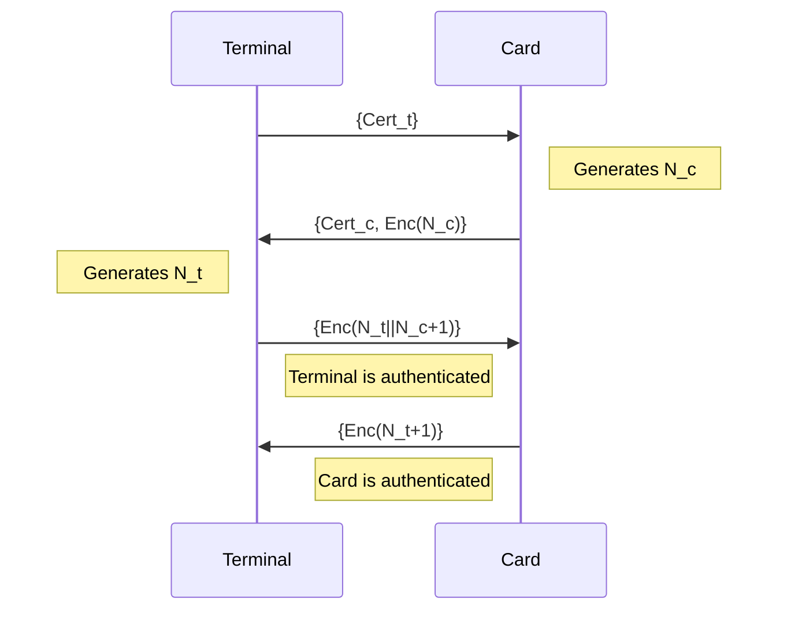
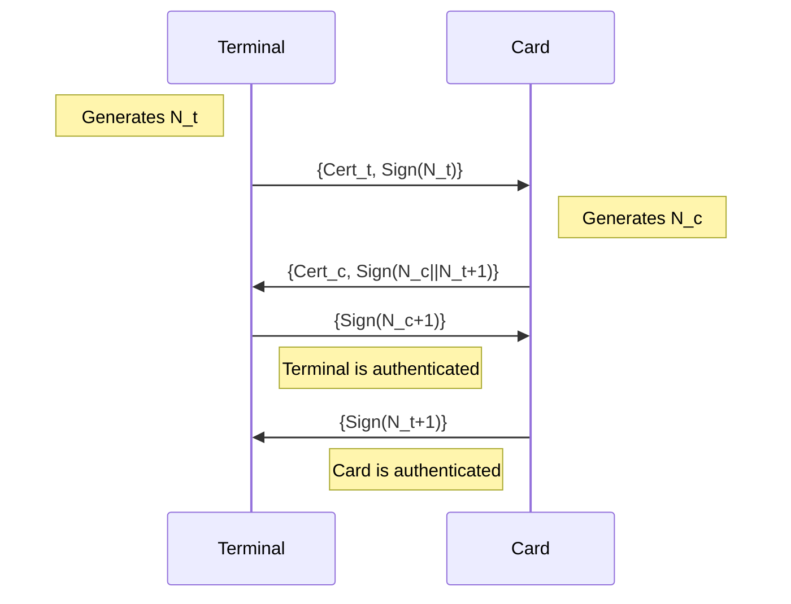
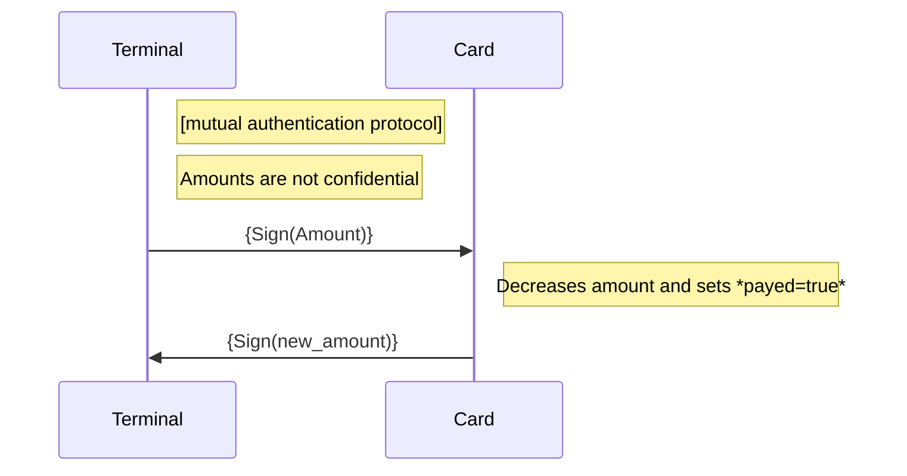
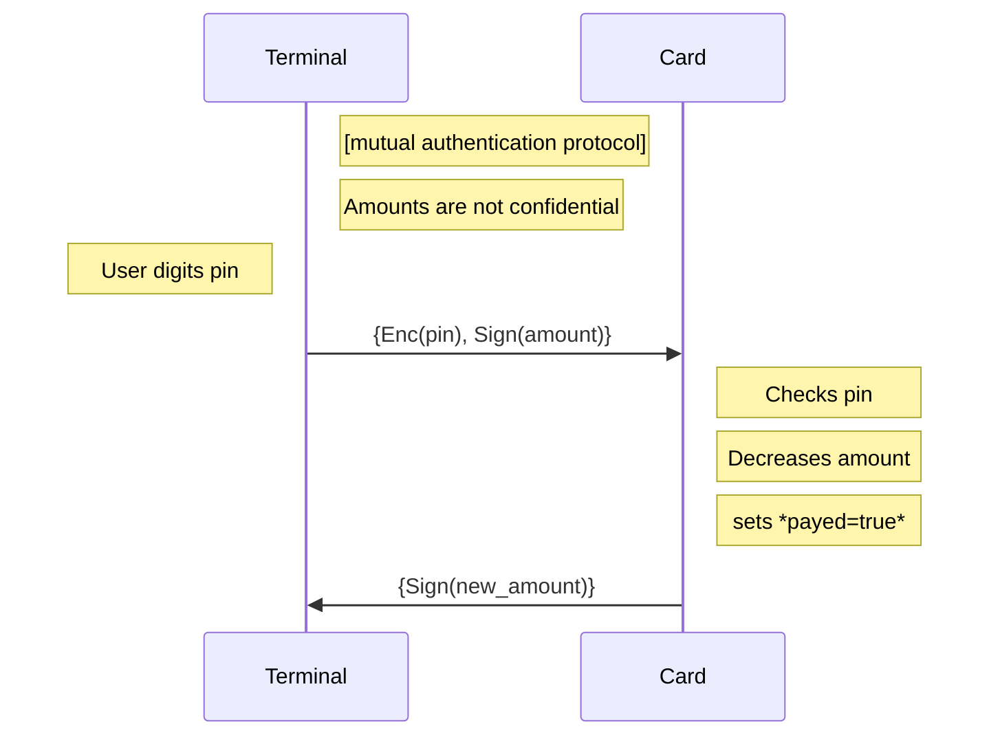
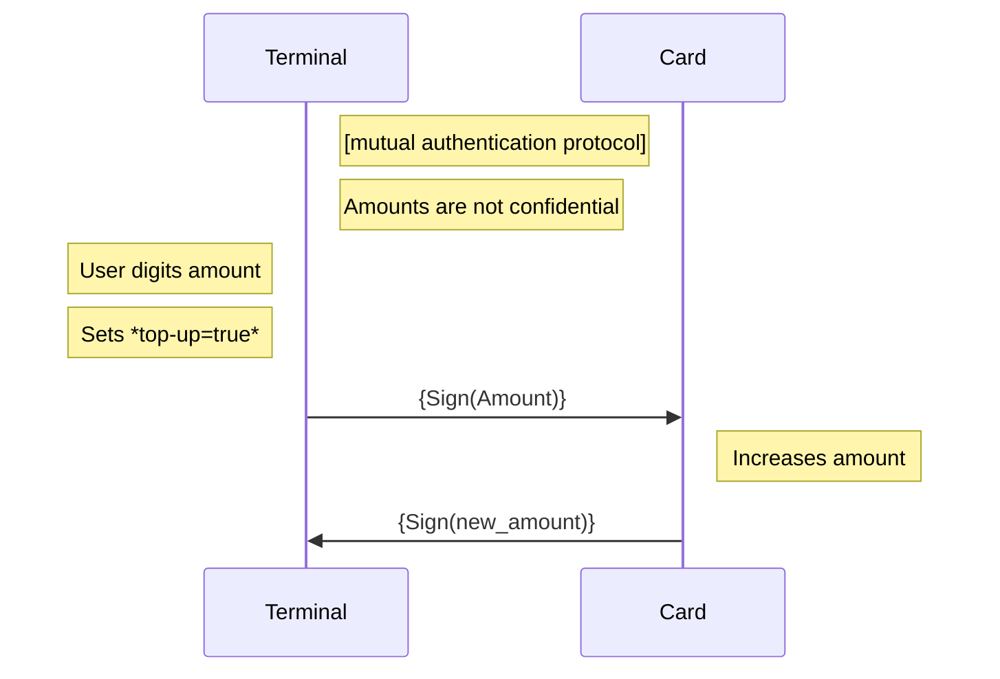

# Mutual authentication (with encryption)

```mermaid
sequenceDiagram
Terminal ->> Card: {Cert_t}
note right of Card: Generates N_c
Card ->> Terminal: {Cert_c, Enc(N_c)}
note left of Terminal: Generates N_t
Terminal ->> Card: {Enc(N_t||N_c+1)}
note right of Terminal:  Terminal is authenticated
Card ->> Terminal: {Enc(N_t+1)}
note left of Card:  Card is authenticated
```

# Mutual authentication (with signature)

```mermaid
sequenceDiagram
note left of Terminal: Generates N_t
Terminal ->> Card: {Cert_t, Sign(N_t)}
note right of Card: Generates N_c
Card ->> Terminal: {Cert_c, Sign(N_c||N_t+1)}

Terminal ->> Card: {Sign(N_c+1)}
note right of Terminal:  Terminal is authenticated
Card ->> Terminal: {Sign(N_t+1)}
note left of Card:  Card is authenticated
```

# Payment (without PIN)

```mermaid
sequenceDiagram
note right of Terminal: [mutual authentication protocol]
note right of Terminal: Amounts are not confidential
Terminal ->> Card: {Sign(Amount)}
note right of Card: Decreases amount and sets *payed=true*
Card ->> Terminal : {Sign(new_amount)}
```

# Payment (with PIN)

```mermaid
sequenceDiagram
note right of Terminal: [mutual authentication protocol]
note right of Terminal: Amounts are not confidential
note left of Terminal: User digits pin
Terminal ->> Card: {Enc(pin), Sign(amount)}
note right of Card: Checks pin
note right of Card: Decreases amount 
note right of Card: sets *payed=true*
Card ->> Terminal : {Sign(new_amount)}
```

# Top-up

```mermaid
sequenceDiagram
note right of Terminal: [mutual authentication protocol]
note right of Terminal: Amounts are not confidential
note left of Terminal: User digits amount
note left of Terminal: Sets *top-up=true*
Terminal ->> Card: {Sign(Amount)}
note right of Card: Increases amount 
Card ->> Terminal : {Sign(new_amount)}
```